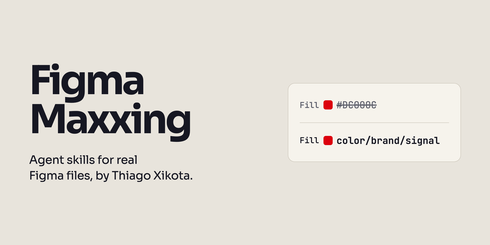
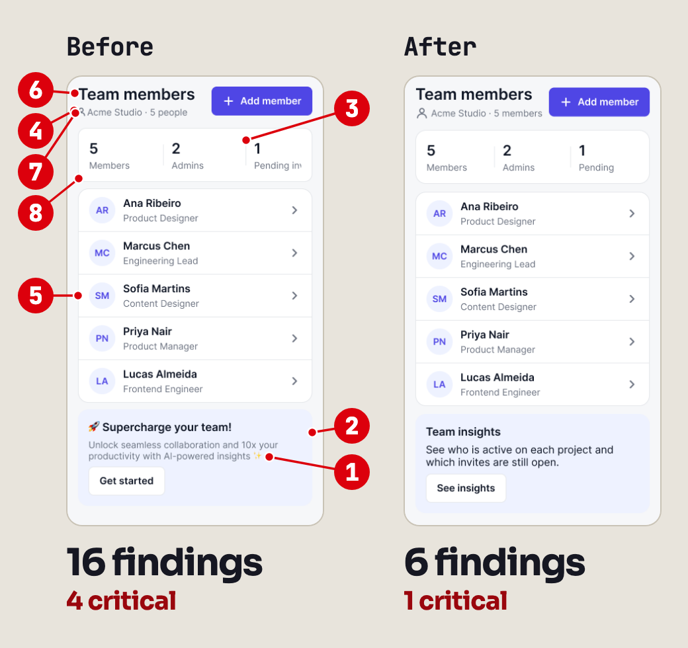
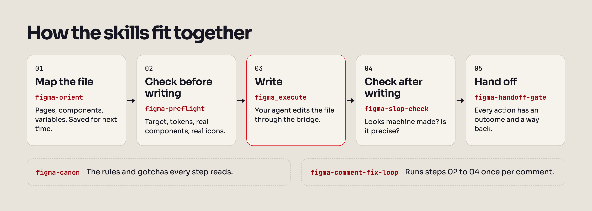

<picture>
  <source media="(prefers-color-scheme: dark)" srcset="../assets/banner-dark.png">
  
</picture>

# figma-maxxing

**Escrevi 8 skills para agentes que editam arquivos reais do Figma.**

A maioria das regras veio de algo que quebrou num arquivo real. Elas dizem ao agente o que olhar antes de editar e como conferir o resultado.

**[Instale e teste](#para-começar)** · [Configuração do seu agente](#instalar-no-seu-agente) · [English](../README.md)

90 gotchas · um gate de handoff com 17 checagens

[](https://github.com/thiagoxikota/figma-maxxing/actions/workflows/test.yml)
[](https://www.skills.sh/thiagoxikota/figma-maxxing)
[](../LICENSE)

## Para começar

Instale as skills:

```bash
npx skills add thiagoxikota/figma-maxxing
```

Conecte o agente ao Figma pelo servidor MCP oficial da Figma ou pelo figma-console-mcp ([como configurar](#o-que-você-precisa)). Depois cole o link de um frame e peça: "Rode figma-slop-check e figma-handoff-gate neste frame. Liste o que precisa de correção."

Você precisa de um agente de código que carregue skills e do Node.js para rodar o `npx`. A instalação rodou no Claude Code, no Codex, no Copilot CLI e no Gemini CLI. O Cursor e os apps do Claude, no desktop e na web, ainda não foram testados. Sem um agente de código, [use este prompt](#cole-na-sua-ia) para pedir checagens que você mesmo pode fazer.

## Antes e depois

<picture>
  <source media="(prefers-color-scheme: dark)" srcset="../assets/demo/before-after-dark.png">
  
</picture>

**Teste no servidor MCP oficial da Figma, 05/10/2026: a auditoria achou os 10 defeitos plantados, nenhum ficou de fora.** Quem plantou os defeitos tinha lido as skills, o prompt do auditor dizia onde olhar, e foi uma tela em uma rodada.

Um agente montou uma tela de demonstração com 10 defeitos plantados e um gabarito. Outro, sem o gabarito, rodou o `figma-slop-check` e o `figma-handoff-gate`. Um terceiro comparou a auditoria com o gabarito. A auditoria também apontou 14 itens fora do gabarito (13 problemas diferentes: os dois gates pediram a mesma renomeação). Depois de uma passada de correção, o `figma-slop-check` caiu de 16 achados para 6, mas nenhum dos dois gates passou. Também tem uma [animação de 9 segundos](../assets/demo/demo.gif).

<details>
<summary>Os marcadores, como o teste rodou e os limites dele</summary>

Os marcadores apontam para os 8 primeiros itens da lista do `figma-slop-check`, traduzidos:

1. **WCAG:** texto do card de upsell com contraste e tamanho abaixo do mínimo
2. **NOMES:** nome padrão do Figma no card de upsell
3. **NOMES:** nome padrão do Figma num divisor
4. **NOMES:** nomes padrão do Figma no ícone de metadados
5. **INSTÂNCIA:** cópia desanexada do ListItem
6. **TOKEN:** título com hex solto
7. **ÍCONE:** ícone de pessoa desenhado à mão no lugar do Icon/User
8. **RAIO:** raio do card de resumo fora da escala

O teste usou uma tela de demonstração com 10 defeitos plantados e um gabarito. O agente que montou a tela tinha lido as skills. Outro agente, que nunca viu o gabarito, rodou o `figma-slop-check` e o `figma-handoff-gate` pelo servidor MCP oficial da Figma. O prompt dele dizia o que inspecionar: variáveis vinculadas, instâncias e frames, espaçamento, raio, nomes e limites de texto. Um terceiro agente, o juiz, comparou a lista de problemas com o gabarito.

**A auditoria achou os 10 defeitos plantados, nenhum pela metade, e nenhum passou batido.** Quem plantou os defeitos tinha lido as skills, o prompt do auditor dizia onde olhar, e foi uma tela em uma rodada. A lista tinha 27 itens: 16 do `figma-slop-check` e 11 do `figma-handoff-gate`. Desses, 13 batem com algum defeito plantado (alguns defeitos aparecem em mais de um item). Os outros 14 itens apontam problemas fora do gabarito: são 13 diferentes, porque os dois gates pediram a mesma renomeação. Nenhum é desmentido pelo gabarito nem pelas capturas, mas 2 só poderiam ser conferidos abrindo o arquivo, e o juiz não abriu. Um dos 14 é uma falha de contraste que nem o gabarito tinha pegado.

Depois, um quarto agente rodou o `figma-preflight`, corrigiu a tela e releu cada propriedade que mudou. O `figma-slop-check` e o `figma-handoff-gate` rodaram de novo, e nenhum dos dois passa ainda:

- **figma-slop-check:** de 16 achados para 6, 1 deles crítico (não existe estado de foco em lugar nenhum). Dos 6 que sobraram, 2 vêm da primeira auditoria, 2 já estavam na tela, mas a primeira auditoria não tinha apontado, e 2 nasceram da própria correção.
- **figma-handoff-gate:** de 11 problemas para 13 (8 bloqueios), quase todos ligados a fluxos e estados que a correção não desenhou.

São capturas reais do MCP oficial da Figma, de 05/10/2026, num arquivo de demonstração feito para o teste. O agente que plantou os defeitos tinha lido estas skills, e o prompt do auditor apontava as propriedades em que estava a maioria dos defeitos. Então o teste mostra que as checagens pegam problema num arquivo do Figma de verdade, montado para o teste, mas não que peguem tudo. As chamadas de ferramenta e o que o servidor oficial não conseguiu fazer estão no [works-with.md](works-with.md#blind-demo-on-the-official-figma-mcp), em inglês.

</details>

## Cole na sua IA

Não precisa instalar nada. Cole o texto abaixo na sua IA e preencha os colchetes. O prompt rodou nas ferramentas de terminal do Claude, do Codex e do Gemini. Os apps de chat ainda não foram testados.

```text
Use este arquivo como referência:
https://raw.githubusercontent.com/thiagoxikota/figma-maxxing/main/llms.txt
Se não conseguir abrir, me avise e
não invente.
Sou designer. [Tenho / Não tenho] um
agente de IA conectado ao Figma.
Meu contexto: [plano do Figma, se
meus arquivos têm design system, se
trabalho sozinho ou em time].
Escolha no máximo cinco regras para o
meu trabalho. Para cada uma, me dê
uma checagem que eu consiga fazer no
Figma hoje. Depois, diga se alguma
skill vale a pena instalar no meu
caso.
```

## O que dá errado, e qual skill pega

- O agente desenha um ícone que a biblioteca já tem → o `figma-preflight` procura antes.
- O agente diz "pronto" e nada mudou → regras de releitura do `figma-preflight`.
- Hex solto, camada com nome padrão, instância desanexada → `figma-slop-check`.
- O handoff mostra "adicionar" e nunca "remover" → `figma-handoff-gate`.
- Você resolve comentário por comentário, na mão → `figma-comment-fix-loop`.
- A bridge caiu de novo → `figma-bridge-doctor`.

## As skills

- **[`figma-canon`](../skills/figma-canon/SKILL.md)** · As regras e os gotchas. Carrega por partes, só o que a tarefa pede.
- **[`figma-preflight`](../skills/figma-preflight/SKILL.md)** · Antes de toda edição. Manda o agente rodar as checagens e dizer se a edição pode seguir ou o que falta, sem alterar o canvas.
- **[`figma-orient`](../skills/figma-orient/SKILL.md)** · Primeiro contato com um arquivo. Mapeia páginas, componentes e variáveis e salva o mapa.
- **[`figma-slop-check`](../skills/figma-slop-check/SKILL.md)** · Depois de editar. Manda o agente revisar o texto gerado, o layout e os valores fora das suas escalas e tokens.
- **[`figma-handoff-gate`](../skills/figma-handoff-gate/SKILL.md)** · Antes do handoff. Toda ação precisa de um destino e de um caminho de volta.
- **[`figma-comment-fix-loop`](../skills/figma-comment-fix-loop/SKILL.md)** · Quando chega feedback. Transforma os comentários abertos em correções, com evidência de cada uma.
- **[`figma-click-flow`](../skills/figma-click-flow/SKILL.md)** · "Vira isso em fluxo." Desenha setas dos elementos clicáveis até as telas de destino.
- **[`figma-bridge-doctor`](../skills/figma-bridge-doctor/SKILL.md)** · A bridge do figma-console caiu. Diagnostica e recupera a conexão (scripts para macOS).

As skills estão escritas em inglês, para servir também a quem não fala português. Você conversa com o agente em português normalmente.

<details>
<summary>Como elas se encaixam</summary>

<picture>
  <source media="(prefers-color-scheme: dark)" srcset="../assets/flow-dark.png">
  
</picture>

</details>

## Alguns gotchas

- [Mudar o `action` de uma reação de protótipo não faz nada.](../skills/figma-canon/references/field-notes.md#re-pointing-a-reaction-write-actions-not-action) O Figma lê `actions`, e mesmo assim a chamada volta com sucesso.
- [O `instance.resize()` deixa o ícone no tamanho original dentro de uma caixa pequena.](../skills/figma-canon/references/plugin-api-anomalies.md#instanceresize-does-not-scale-the-children-use-rescale) Use `rescale()`.
- [Sections novas saem pretas, mesmo com o preenchimento vinculado a uma variável de cor.](../skills/figma-canon/references/field-notes.md#a-section-fill-bound-to-a-variable-renders-the-base-color-you-passed) A section mostra a cor base que você passou ao vincular, não a variável. Resolva a variável antes de vincular.
- [Numa varredura pela bridge do figma-console, algumas edições dentro de um grupo bloqueado não entraram.](../skills/figma-canon/references/field-notes.md#writes-under-a-locked-ancestor-did-not-take-through-the-figma-console-bridge) Nada deu erro, e cada camada dizia `locked: false`. As typings da Figma dizem que `locked` não impede edição feita por plugin, então a causa não está estabelecida. Quem pegou o problema foi uma contagem feita depois da varredura.

**[Todos os gotchas, organizados por sintoma](gotchas.md)**, do jeito que um designer descreveria, e uma lista [por mensagem de erro](gotchas.md#by-error-message). A página está em inglês.

## Por que isso, se a Figma tem skills oficiais

As skills da própria Figma ajudam o agente a criar no Figma. As deste repositório conferem o trabalho do agente antes e depois de cada edição, e de novo no handoff. Use os dois conjuntos. O [landscape.md](landscape.md#how-figma-maxxing-composes-with-figmas-skills), em inglês, mapeia os servidores e os conjuntos de skills em volta do Figma, com datas.

- **Bridge do figma-console:** as 8 skills, no meu trabalho em produção.
- **MCP oficial da Figma:** o `figma-preflight`, o `figma-slop-check` e o `figma-handoff-gate` rodaram lá uma vez, no arquivo de demonstração do teste acima, com alguns passos adaptados ou pulados ([a lista](works-with.md#blind-demo-on-the-official-figma-mcp), em inglês). Essa rodada usou a lente de rigor anterior do `figma-slop-check`; a 1.2.0 reescreveu essa lente em 5 grupos e 11 itens. O `figma-orient`, o `figma-comment-fix-loop` e o `figma-click-flow` descrevem esse caminho, mas ainda não rodaram nele. O `figma-bridge-doctor` não se aplica.

Skill por skill: [works-with.md](works-with.md).

## Instalar no seu agente

O `npx skills add thiagoxikota/figma-maxxing` funciona com a maioria dos agentes. A CLI `skills` é de terceiros e envia contagem anônima de instalação; `DISABLE_TELEMETRY=1` desliga.

Todas as rotas abaixo, menos a do Cursor, rodaram em 05/10/2026 numa pasta de teste limpa, e cada uma instalou as 8 skills na versão 1.1.1. Claude Code, Codex, Copilot CLI e `npx skills add thiagoxikota/figma-maxxing` instalaram a partir da main do GitHub, no commit 3693845, o mesmo da tag v1.1.1; no Claude Code, a instalação usou a CLI `claude plugin`, a versão de terminal dos dois comandos de barra. O Gemini CLI instalou a release v1.1.1. O `-a opencode` e o `-a windsurf` rodaram mais cedo, no mesmo dia, a partir de uma cópia local do repositório.

<details>
<summary><b>Claude Code</b></summary>

```text
/plugin marketplace add thiagoxikota/figma-maxxing
/plugin install figma-maxxing@figma-maxxing-skills
```

As skills aparecem como `/figma-maxxing:figma-preflight` e assim por diante. O plugin só tem skills: nenhum hook, nenhum servidor MCP. As descrições das skills custam cerca de 1.200 tokens em toda sessão (`claude plugin details`, Claude Code 2.1.289).

</details>

<details>
<summary><b>Codex</b></summary>

```bash
codex plugin marketplace add thiagoxikota/figma-maxxing
codex plugin add figma-maxxing@figma-maxxing-skills
```

Rodou com o codex-cli 0.156.1.

</details>

<details>
<summary><b>GitHub Copilot CLI</b></summary>

```bash
copilot plugin marketplace add thiagoxikota/figma-maxxing
copilot plugin install figma-maxxing@figma-maxxing-skills
```

Rodou com o Copilot CLI 1.0.61.

</details>

<details>
<summary><b>Gemini CLI</b></summary>

```bash
gemini extensions install https://github.com/thiagoxikota/figma-maxxing
```

Rodou com o Gemini CLI 0.43.0, que instalou a 1.1.1 a partir da última release do GitHub. Ele pede para você confiar na pasta e confirmar a instalação; o `--consent` responde as duas perguntas, e foi assim que o teste rodou.

</details>

<details>
<summary><b>Cursor</b> (não testado)</summary>

Não tenho o Cursor instalado, então essa rota não rodou. Segundo a documentação, o Cursor lê o `.cursor-plugin/plugin.json`. Para testar, copie o repositório para `~/.cursor/plugins/local/figma-maxxing` e recarregue a janela. Ou use a CLI `skills`:

```bash
npx skills add thiagoxikota/figma-maxxing -a cursor
```

</details>

<details>
<summary><b>OpenCode, Windsurf e outros agentes</b></summary>

```bash
npx skills add thiagoxikota/figma-maxxing -a opencode
npx skills add thiagoxikota/figma-maxxing -a windsurf
```

O `-a` também aceita `codex`, `cursor`, `gemini-cli`, `github-copilot` e `claude-code`. Acrescente `-g` para instalar na sua pasta de usuário. No teste, a CLI gravou as 8 skills em `.agents/skills` (`.windsurf/skills` no Windsurf, `.claude/skills` no `claude-code`). Os agentes em si não chegaram a ser executados.

</details>

<details>
<summary><b>Cópia manual</b></summary>

```bash
git clone https://github.com/thiagoxikota/figma-maxxing.git
cd figma-maxxing
python3 install.py --scope user --dry-run
```

O `--dry-run` mostra o que seria copiado. Depois rode uma destas duas linhas, não as duas:

- `python3 install.py --scope user` instala para o Claude Code em `~/.claude/skills`.
- `python3 install.py --target agents --scope user` instala em `~/.agents/skills`, para Codex, Cursor, Gemini CLI e outros.

O instalador copia pastas e se recusa a sobrescrever uma skill que já existe.

</details>

## O que você precisa

As skills precisam de um agente que carregue Agent Skills e de uma conexão com o Figma. Dá para conectar de dois jeitos.

**Servidor MCP oficial da Figma.** Conecte com sua conta da Figma por OAuth. No Claude Code:

```bash
claude mcp add --transport http figma https://mcp.figma.com/mcp
```

Para outros agentes, veja o [guia da Figma](https://github.com/figma/mcp-server-guide). Editar pelo `use_figma` exige um assento Full, menos nos seus próprios rascunhos, onde o [FAQ do servidor MCP da Figma](https://help.figma.com/hc/en-us/articles/39252411778583-Figma-MCP-server-FAQs) também deixa um assento Dev editar. No plano Starter o limite de chamadas é baixo ([nota de campo](../skills/figma-canon/references/field-notes.md#the-official-figma-mcp-server-has-a-hard-tool-call-cap-on-a-starter-plan)). Usar o servidor significa aceitar os [Termos de Desenvolvedor da Figma](https://www.figma.com/legal/developer-terms/).

**[figma-console-mcp](https://github.com/southleft/figma-console-mcp)**, da Southleft (MIT). É a rota que eu uso no meu trabalho e a que serviu de base para estas skills. Roda na sua máquina e se conecta ao Figma Desktop (macOS ou Windows) pelo plugin Desktop Bridge. Você precisa do Node.js 18 ou mais novo e de um token pessoal da Figma. Conferido pela última vez na v1.40.8. No Claude Code:

```bash
claude mcp add figma-console -s user \
  -e FIGMA_ACCESS_TOKEN=figd_YOUR_TOKEN_HERE \
  -e ENABLE_MCP_APPS=true \
  -- npx -y figma-console-mcp@latest
```

1. Reinicie o Claude Code. Na primeira vez, o servidor cria o manifesto do plugin.
2. No Figma Desktop, abra um arquivo e vá em Plugins, Development, Import plugin from manifest. Escolha `~/.figma-console-mcp/plugin/manifest.json` (`~` é a sua pasta de usuário).
3. Rode o plugin Figma Desktop Bridge no arquivo em que você vai trabalhar.
4. Peça ao agente: "confere a conexão com o Figma". Ele deve chamar `figma_get_status`.

Esse comando grava o token em texto puro na configuração do agente, e o próprio comando, com o token, pode ficar no histórico do terminal. Trate a configuração e o histórico como segredo e nunca suba nenhum dos dois para o Git. Em outros agentes, siga o [guia do projeto original](https://github.com/southleft/figma-console-mcp#readme).

**Para o fluxo de comentários, em qualquer servidor:** um token pessoal com File content (leitura), File versions (leitura), Variables (leitura) e Comments (leitura e escrita). O `figma-comment-fix-loop` lê os comentários pela API REST.

As skills são Markdown puro e rodam onde o seu agente rodar. Os scripts de recuperação da bridge são só para macOS. Este repositório e o figma-console-mcp são gratuitos; o agente e o seu plano da Figma, não.

### O hook opcional

O `hooks/figma-canon-precheck.py` lê o script que o agente vai rodar no Figma e avisa sobre 13 padrões problemáticos conhecidos antes de a chamada chegar ao Figma. Ele nunca é instalado automaticamente. Para ligar no Claude Code, coloque isto no seu `settings.json`:

```json
{
  "hooks": {
    "PreToolUse": [
      {
        "matcher": "mcp__figma-console__figma_execute(_across_files)?",
        "hooks": [
          {
            "type": "command",
            "command": "python3 /caminho/para/figma-maxxing/hooks/figma-canon-precheck.py",
            "timeout": 10
          }
        ]
      }
    ]
  }
}
```

Por padrão ele só avisa. Com `FIGMA_PRECHECK_MODE=block`, ele recusa os 5 padrões marcados como `BLOCK`, os que quebram a chamada. O matcher acima só dispara na bridge do figma-console; o hook ainda não foi testado com o `use_figma` do servidor oficial.

### Antes de usar na biblioteca do time

As skills são instruções que o agente lê. Sozinhas, elas não controlam permissões nem bloqueiam edições.

- **Só leitura.** O `figma-canon`, o `figma-preflight` e o `figma-orient` mandam o agente deixar o canvas como está. O `figma-orient` salva o mapa no seu projeto, não no arquivo do Figma.
- **Relatório antes.** O `figma-slop-check` e o `figma-handoff-gate` mandam o agente relatar os problemas e esperar a aprovação antes de aplicar cada correção. A exceção é uma falha de slop num trabalho que o próprio agente acabou de fazer: o `figma-slop-check` manda corrigir antes de responder.
- **Comentário é dado.** O `figma-comment-fix-loop` manda o agente mostrar os comentários em que vai mexer e esperar o seu sim. Instruções escritas nos comentários entram como dados.
- **Rascunho primeiro.** O `figma-canon` manda o agente trabalhar num rascunho ou numa branch até você aprovar, a menos que você diga outra coisa. É uma instrução, não uma checagem: nada impede uma edição numa biblioteca compartilhada, então diga ao agente qual rascunho usar.
- **Um arquivo, vários agentes.** Antes de editar, o `figma-preflight` manda o agente reservar o arquivo com um lock. Esse lock só coordena as sessões que consultam a reserva; o Figma não o impõe.
- **Nada em segundo plano.** O plugin não traz hook nem servidor MCP. O watchdog da bridge e o daemon `mcp-direct` só sobem quando você manda.
- **Sem telemetria.** O repositório não coleta nada: [PRIVACY.md](../PRIVACY.md). Notas de segurança e relato privado de falhas: [SECURITY.md](../SECURITY.md).

## Como isso é verificado

Todo push roda o [test.yml](../.github/workflows/test.yml):

- Testes unitários do lock, do hook, do instalador, dos links e dos padrões de privacidade, no Ubuntu e no macOS, com Python 3.10 e 3.13.
- Todo nome da Plugin API citado nas skills, conferido contra o `@figma/plugin-typings` 1.140.0: zero erros em 05/10/2026. Na árvore anterior ao commit 1dca321 (a correção das anotações), a mesma conferência acusa 3 erros.
- Toda contagem de skills, gotchas e checagens citada na documentação, recontada a partir dos arquivos.
- O validador de referência das Agent Skills e o validador de plugins do Claude Code.
- Todo link, inclusive as âncoras (lychee).
- O histórico inteiro do git varrido atrás de segredos (gitleaks), os workflows revisados pelo actionlint e cada action fixada num SHA de commit.

Toda semana, o [drift.yml](../.github/workflows/drift.yml) roda a conferência da API contra as typings mais novas e abre uma issue quando um nome quebra. O [scorecard.yml](../.github/workflows/scorecard.yml) roda o OpenSSF Scorecard.

Cada versão publicada ([release.yml](../.github/workflows/release.yml)) gera um zip por skill e um pacote do plugin a partir do commit da tag, gera tudo duas vezes, falha se os bytes mudarem e anexa uma atestação de proveniência do build. Para conferir um download:

```bash
gh attestation verify figma-preflight-1.1.1.zip \
  --repo thiagoxikota/figma-maxxing
```

Este repositório tem uma entrada no [M8ven Trust Index](https://m8ven.ai/mcp/thiagoxikota/figma-maxxing), reivindicada pelo próprio autor. A nota pública lá é C (Emerging). Na subnota de código, o projeto tirou 100 de 100, numa leitura de 04/10/2026 do commit 1dca321, anterior à 1.1.0.

[](https://m8ven.ai/mcp/thiagoxikota-figma-maxxing-1lm8zs?s=readme)

## Até onde foi testado

Em 05/10/2026:

- **Meu trabalho.** Construí estas skills no Claude Code, no macOS, com o figma-console-mcp, em arquivos reais. Esta edição pública é uma reescrita daquele conjunto: em inglês, generalizada e sem nenhum detalhe de cliente. Ainda não rodou de ponta a ponta numa segunda máquina.
- **MCP oficial da Figma.** O teste lá de cima, numa tela de demonstração. A auditoria usou 12 chamadas ao MCP da Figma, a correção usou 13 e a segunda auditoria, mais 13. Alguns passos não tinham ferramenta lá ou esbarraram em limite: não há seleção, o `get_screenshot` não captura acima de 1x, não há status da bridge e cada chamada tem limite de 20 KB. Os agentes contornaram esses limites usando o `use_figma` só para ler, sem editar nada, e registraram cada contorno no [works-with.md](works-with.md#blind-demo-on-the-official-figma-mcp).
- **Instalações.** Todas as rotas de [Instalar no seu agente](#instalar-no-seu-agente), menos o Cursor, a partir da main do GitHub, da release v1.1.1 ou de uma cópia local, como está descrito lá.

Se alguma coisa ainda depender do meu ambiente, [abra uma issue](https://github.com/thiagoxikota/figma-maxxing/issues) com o seu ambiente e o erro exato.

## Contribuir

Um gotcha que você encontrou de verdade, com o sintoma, a causa e a correção que você aplicou, cabe aqui. Dúvidas e prints de antes e depois vão para as [Discussions](https://github.com/thiagoxikota/figma-maxxing/discussions); bugs e gotchas, para as [issues](https://github.com/thiagoxikota/figma-maxxing/issues/new/choose). Veja o [CONTRIBUTING.md](../CONTRIBUTING.md), o [código de conduta](../CODE_OF_CONDUCT.md) e o [changelog](../CHANGELOG.md). Vai contribuir com um agente? Peça para ele ler o [AGENTS.md](../AGENTS.md).

## Quem fez

Sou o Thiago Xikota, AI Product Designer, fundador da Xikota Design e pesquisador no Lemme (UFSC). Estou escrevendo o *Design na era da IA* (Casa do Código, em produção). [Me siga no LinkedIn](https://www.linkedin.com/in/thiagoxikota).

## Créditos

Feito em cima do [figma-console-mcp](https://github.com/southleft/figma-console-mcp), da Southleft. O formato das skills é o padrão aberto [Agent Skills](https://agentskills.io).

Sem vínculo com a Figma. Figma é marca registrada da Figma, Inc.

## Licença

MIT. Veja [LICENSE](../LICENSE).
